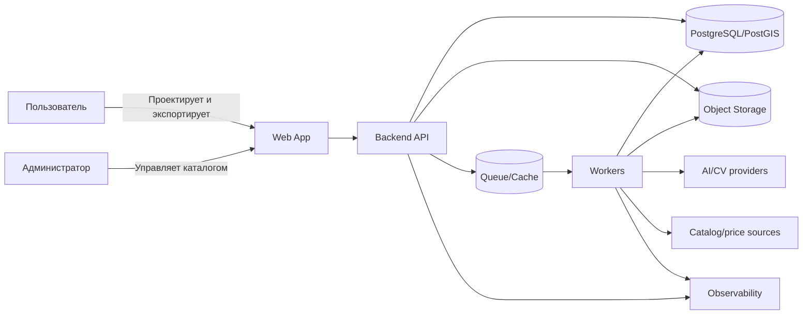
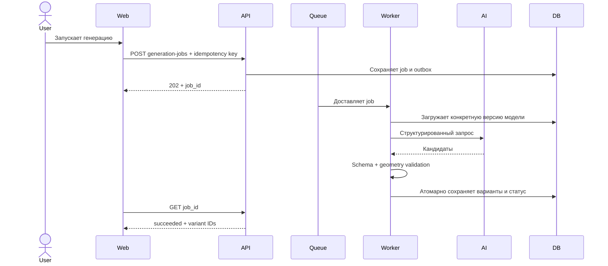

# Диаграммы системы

## Контекст

```mermaid
flowchart LR
    U[Пользователь] -->|Проектирует и экспортирует| WEB[Web App]
    A[Администратор] -->|Управляет каталогом| WEB
    WEB --> API[Backend API]
    API --> DB[(PostgreSQL/PostGIS)]
    API --> OBJ[(Object Storage)]
    API --> Q[(Queue/Cache)]
    Q --> W[Workers]
    W --> DB
    W --> OBJ
    W --> AI[AI/CV providers]
    W --> CAT[Catalog/price sources]
    API --> OBS[Observability]
    W --> OBS
```

## Поток генерации

```mermaid
sequenceDiagram
    actor User
    participant Web
    participant API
    participant Queue
    participant Worker
    participant AI
    participant DB

    User->>Web: Запускает генерацию
    Web->>API: POST generation-jobs + idempotency key
    API->>DB: Сохраняет job и outbox
    API-->>Web: 202 + job_id
    Queue->>Worker: Доставляет job
    Worker->>DB: Загружает конкретную версию модели
    Worker->>AI: Структурированный запрос
    AI-->>Worker: Кандидаты
    Worker->>Worker: Schema + geometry validation
    Worker->>DB: Атомарно сохраняет варианты и статус
    Web->>API: GET job_id
    API-->>Web: succeeded + variant IDs
```
